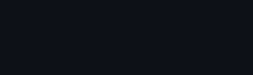

#

 
  
<h2>Stats and Activity</h2>

<a><strong>Note</strong>: Top languages is only a metric of the languages my public code consists of and doesn't reflect experience or skill level.</a>

 
  
<h2>My Languages</h2>

  <!-- Some badges are from https://github.com/Ileriayo/markdown-badges -->
  <h3>Standard languages</h3>
        
        
        
        
        
        
        
        

 <h3>Tools</h3>
        
        
        
        
        
        

